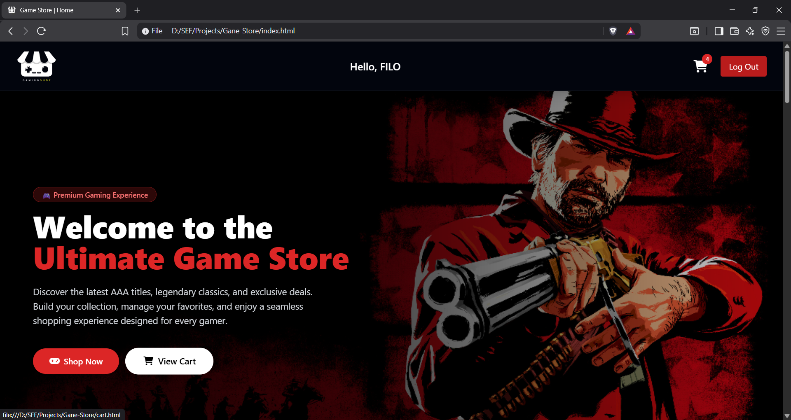
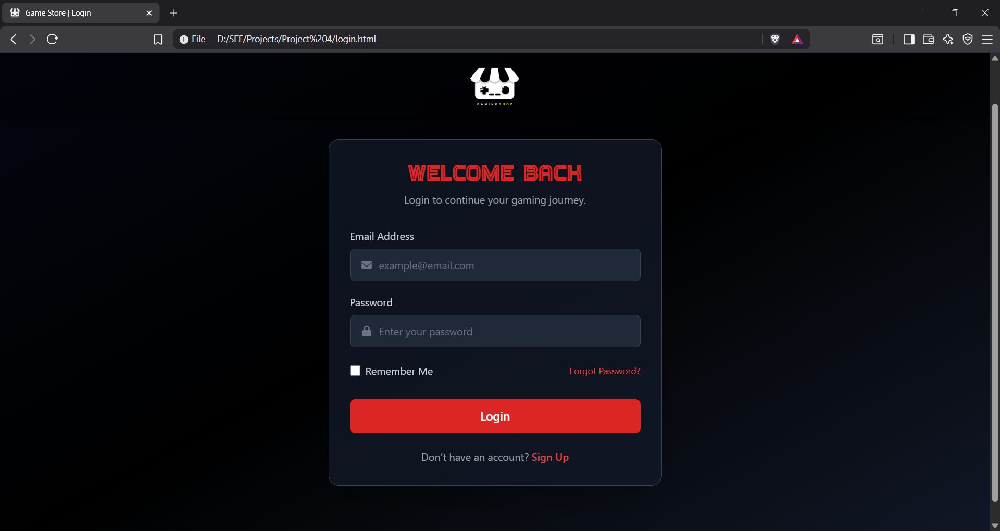
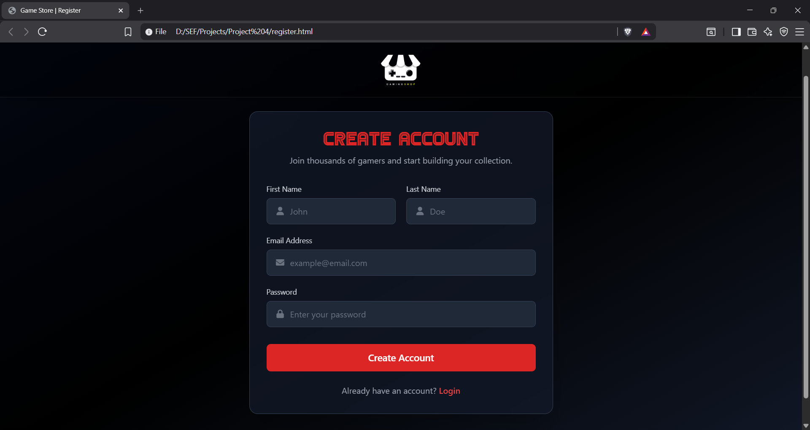
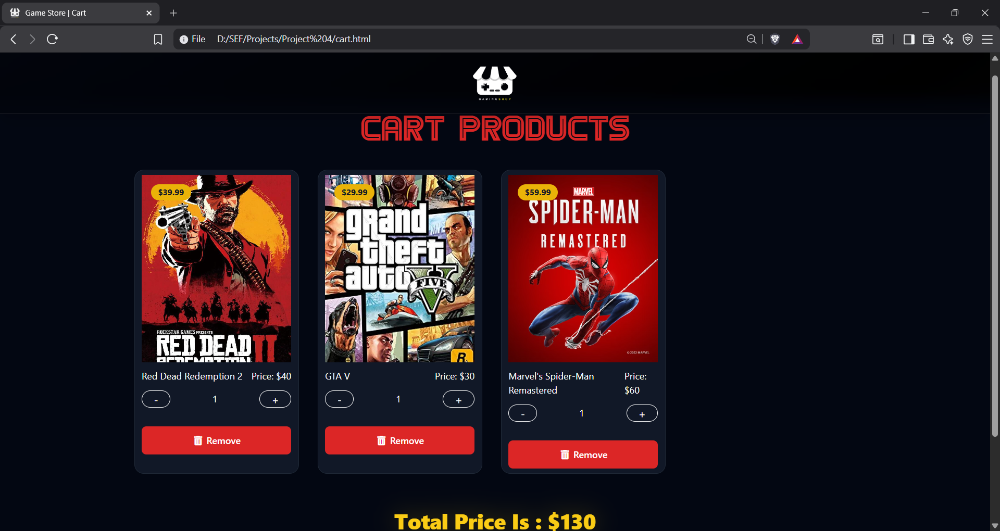
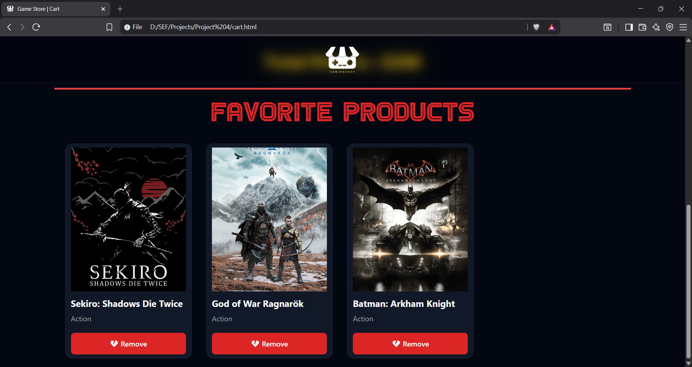

# 🎮 Game Store

<div align="center">

\

</div>

## 📋 Overview

**Game Store** is a modern and fully responsive e-commerce web application built with **HTML5, Tailwind CSS, and Vanilla JavaScript**.

The application provides a complete front-end shopping experience where users can create an account, log in, browse a collection of games, search and filter products, add items to a shopping cart, manage favorites, and keep their data stored using the **Local Storage API**.

This project demonstrates responsive web design, DOM manipulation, form validation, local storage management, and dynamic UI rendering without using any JavaScript framework.

---

# 📸 Screenshots

<div align="center">
<table>

<tr>
<td></td>
<td></td>
</tr>

<tr>
<td align="center"><strong>Home Page</strong></td>
<td align="center"><strong>Login Page</strong></td>
</tr>

<tr>
<td></td>
<td></td>
</tr>

<tr>
<td align="center"><strong>Register Page</strong></td>
<td align="center"><strong>Shopping Cart</strong></td>
</tr>

<tr>
<td colspan="2" align="center">

</td>
</tr>

<tr>
<td colspan="2" align="center">
<strong>Favorite Games</strong>
</td>
</tr>

</table>
</div>

---

# 🚀 Live Demo

🌐 **Visit the Website**

🔗 https://your-live-demo-link.com

---

# ✨ Key Features

## 👤 User Authentication

* Create a new account
* Login using email and password
* Client-side form validation
* Remember Me functionality
* Logout system
* Personalized welcome message
* User session stored using Local Storage

---

## 🎮 Game Catalog

* Modern responsive game cards
* Featured games section
* Browse 25+ popular games
* Dynamic product rendering
* Beautiful hover animations
* Responsive layout for all devices

---

## 🔍 Search & Filter

* Search games by title
* Filter games by category
* Dynamic product counter
* Instant UI updates

---

## 🛒 Shopping Cart

* Add products to cart
* Remove products from cart
* Increase quantity
* Decrease quantity
* Live cart counter
* Cart preview dropdown
* Automatic total price calculation
* Dedicated Cart page

---

## ❤️ Favorite Games

* Add games to favorites
* Remove favorite games
* Favorite icon toggle
* Favorite products section
* Favorite list stored in Local Storage

---

## 💾 Local Storage

The application stores:

* User information
* Login status
* Remember Me option
* Shopping cart
* Favorite games

allowing users to continue where they left off after refreshing the page.

---

# 🛠 Technologies Used

## Frontend

| Technology        | Purpose                 |
| ----------------- | ----------------------- |
| HTML5             | Semantic page structure |
| Tailwind CSS      | Responsive UI styling   |
| JavaScript (ES6)  | Application logic       |
| Font Awesome      | Icons                   |
| Local Storage API | Client-side storage     |

---

## Tools

| Tool            | Purpose             |
| --------------- | ------------------- |
| Git             | Version Control     |
| GitHub          | Repository Hosting  |
| GitHub Pages    | Deployment          |
| VS Code         | Code Editor         |
| Chrome DevTools | Testing & Debugging |

---

# ⚙️ Installation

## Prerequisites

* Modern Web Browser
* Git *(Optional)*

---

## Clone the Repository

```bash
git clone https://github.com/filopater23106-cloud/Game-Store.git
```

---

## Open the Project

```bash
cd Game-Store
```

Open **index.html** directly in your browser

or

Use **Live Server** in Visual Studio Code.

No installation or dependencies are required.

---

# 📁 Project Structure

```text
Game-Store/
│
├── index.html
├── login.html
├── register.html
├── cart.html
├── README.md
│
├── css/
│   ├── style.css
│   └── all.min.css
│
├── js/
│   ├── script.js
│   ├── login.js
│   ├── register.js
│   ├── user.js
│   └── cart.js
│
├── images/
│
└── screenshots/
    ├── home.png
    ├── login.png
    ├── register.png
    ├── cart.png
    └── favorite.png
```

---

# 🎨 Application Features

### 🔐 Authentication System

* Register page
* Login page
* Input validation
* Remember Me
* Logout functionality

---

### 🛍 Shopping Experience

* Browse products
* Search games
* Filter by category
* Add to cart
* Remove from cart
* Quantity management
* Live cart updates

---

### ❤️ Favorite System

* Add games to favorites
* Remove favorites
* Persistent favorite storage
* Favorite section in Cart page

---

### 📱 Responsive Design

The website is fully responsive and optimized for:

* 📱 Mobile Devices
* 📱 Tablets
* 💻 Laptops
* 🖥 Desktop Screens

---

# 🎯 Future Improvements

### Planned Features

* Multiple user accounts
* Product details page
* Product sorting
* Live search
* Wishlist page
* Checkout process
* Order history
* Backend integration
* Database support
* Firebase Authentication
* Payment gateway
* Product reviews and ratings
* Admin dashboard
* Dark / Light mode
* Email verification

---

# 📄 License

This project is licensed under the **MIT License**.

---

# 👨‍💻 Author

<div align="center">

## **Filopater Shehata Mina**

Faculty of Computer and Information
Ain Shams University

</div>

---

# 🙏 Acknowledgments

Special thanks to the following technologies and communities:

* Tailwind CSS
* Font Awesome
* JavaScript Community
* GitHub Pages

---

<div align="center">

## ⭐ Show Your Support

If you enjoyed this project, please consider giving it a ⭐ on GitHub.

**Made with ❤️ by Filopater Shehata Mina**

</div>
